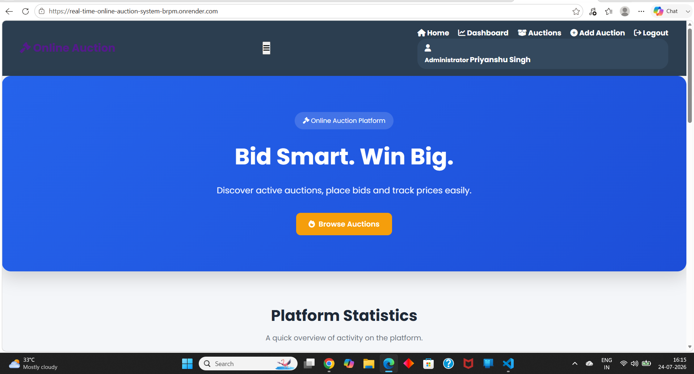
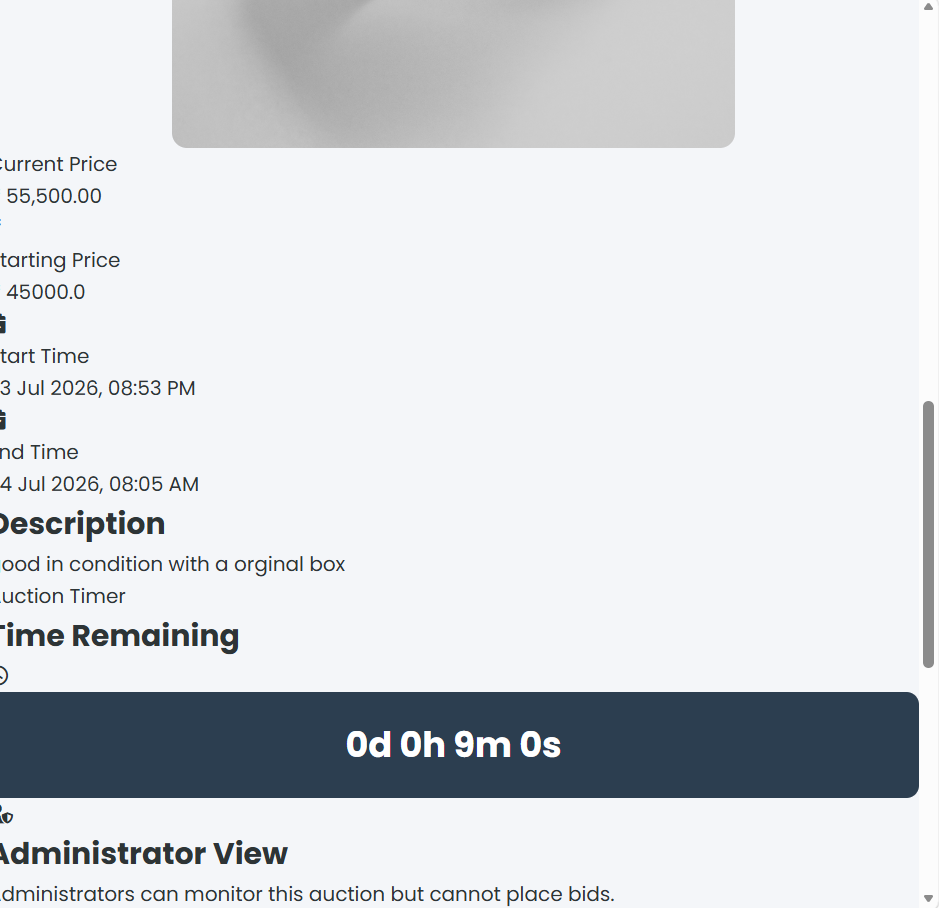
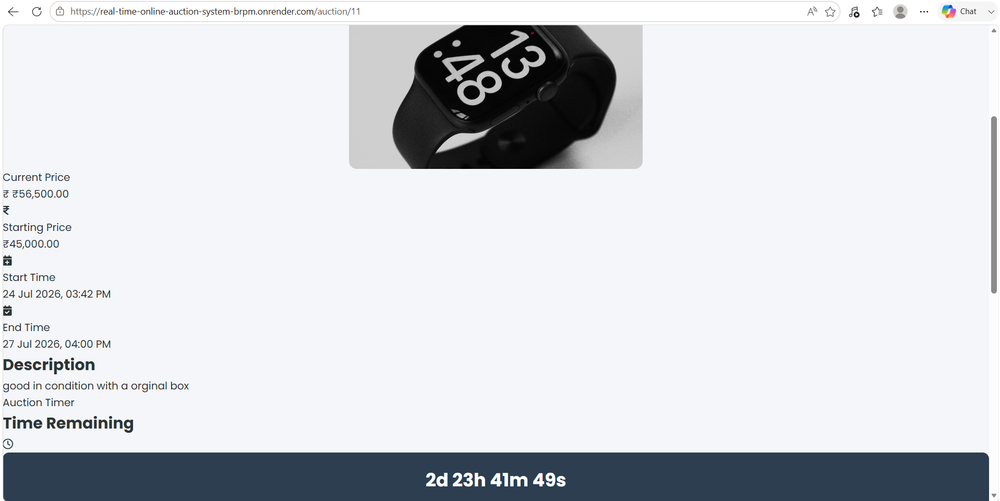
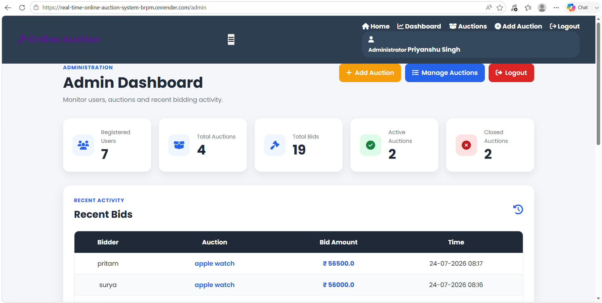

# Real-Time Online Auction System

A full-stack online auction platform developed using Python and Flask. The
application allows users to browse auctions, place bids, track live price
updates, view bid history, and see auction winners.

The system also provides a dedicated administrator interface for creating,
editing, deleting, and monitoring auctions.

## Live Demo

The application is deployed online using Render.

Live Website:
https://real-time-online-auction-system-brpm.onrender.com/

## Screenshots

### Home Page



### Auction Marketplace



### Auction Details



### Admin Dashboard



## Features

### User Features

- User registration and login
- Secure password hashing
- Browse available auctions
- Search auctions
- Filter active and closed auctions
- Sort auctions by price, latest, and ending time
- View complete auction details
- Place bids on active auctions
- Live bid and price updates using AJAX polling
- Auction countdown timer
- View complete bid history
- View personal bid history
- Automatic auction closing
- Automatic winner declaration
- Indian Standard Time (IST) display
- Responsive user interface

### Administrator Features

- Secure administrator dashboard
- Add new auctions
- Edit existing auctions
- Delete auctions
- Upload auction images
- Monitor auction statistics
- View recent auctions and bids
- Administrator-only route protection
- Administrators cannot participate in bidding

## Security Features

- Password hashing
- CSRF protection
- Secure session cookies
- HTTPOnly cookies
- SameSite cookie protection
- HTTPS-only production cookies
- Login rate limiting
- Registration rate limiting
- Bid rate limiting
- Role-based authorization
- Image type and size validation
- Custom 404, 429 and 500 error pages

## Technology Stack

### Backend
- Python
- Flask
- Flask-SQLAlchemy
- SQLAlchemy
- PyMySQL

### Frontend
- HTML5
- CSS3
- JavaScript
- AJAX
- Jinja2
- Font Awesome

### Database
- MySQL
- Aiven Cloud MySQL

### Cloud and Deployment
- Render
- Cloudinary
- GitHub

## Real-Time Auction System

The application uses AJAX polling to periodically retrieve the latest auction
information from the Flask backend.

This allows users to see updated:

- Current auction price
- Bid history
- Auction status

without manually refreshing the page.

## Auction Time Management

Auction times entered by the administrator are interpreted as Indian Standard
Time (IST).

Internally, auction timestamps are stored and compared in UTC. They are
converted back to IST when displayed to users.

This provides consistent auction timing between the server, database,
countdown timer, and users.

## Image Storage

Auction images are stored permanently using Cloudinary.

This prevents uploaded images from being lost when the Render server restarts
or redeploys.

## Database

The production application uses a MySQL database hosted on Aiven.

Main database entities include:

- Users
- Auctions
- Bids

Relationships between these entities allow the system to track users,
auctions, bidding activity, and auction winners.

## Installation

Clone the repository:

```bash
git clone https://github.com/priyanshu-dev31/real-time-online-auction-system.git
